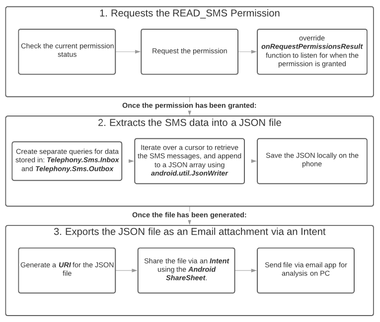

<!--more-->

## Quick rundown of what I learned

- How to use Android Studio
- How to program in Kotlin
- How Android permissions work in terms of requesting and receiving them
- How to query an internal ContentProvider for access to relevant SMS data

## Why am I programming my own app?

There are numerous [existing apps](https://play.google.com/store/search?q=SMS%20Backup&c=apps) on the play store of which I could have used. Due to the sensitive nature of the data I didn't feel confident giving a random 3rd party access to my data. 

Also I have been interested in mobile app-dev for a while now, and this was a great excuse to finally learn how to make an app.

## Basic overview of the app

> Fig 1. An overview of the app's logical flow. Arrows indicate sequential order.

### Step 1: Requests the READ_SMS Permission

All I needed was the READ_SMS permission to access the SMS Inbox and Outbox data. Other data, such as images and group SMS conversations would likely require READ_MMS permissions.

- A list of all the permissions can be found [here](https://developer.android.com/reference/kotlin/android/Manifest.permission)

Certain UI elements are locked until I have appropriate permissions. To check for an update to the permission I used Kotlin's Observable Delegates. `allPermissionsGranted` is a boolean observable delegate that runs a piece of code each time the variable's state is changed. In my case the code updates the UI, enabling the button that begins Step 2.

### Step 2: Extracts the SMS data into a JSON file

Here's a run-down of how the data is stored inside an Android device:

The data is stored in one of many internal database files called ***Data Storage***. In order to enforce security you cannot access the ***Data Storage*** directly. Instead, you [query](https://developer.android.com/reference/kotlin/android/content/ContentProvider?hl=en#query) a ***ContentProvider***. This query is not a SQL query, but it contains similar components.

> A mistake I made here:
>
> SMS Inbox only contains the **RECEIVED** messages. It took me an hour of debugging to realise that my missing **SENT** messages were located in the SMS Outbox instead.

I chose JSON as the data is [semi-structured](https://en.wikipedia.org/wiki/Semi-structured_data): meaning that I could easily change the number of SMS columns used without affecting future analyses.

### Step 3: Exports the JSON file as an attachment via an Intent

What is an **Intent**? An **Intent** is a way to let other apps on the phone do things with your data. An example is the share button in a photo app. There will be a screen showing the various apps that contain the necessary code to process such an **Intent**.

This is using a template called [the Android ShareSheet](https://developer.android.com/training/sharing/send#using-android-system-sharesheet). Just like the photo app can send an image, you can send any file; a.k.a. "[binary content]"(https://developer.android.com/training/sharing/send#send-binary-content). To send my JSON file, all that is needed is:

- A URI location of the file. This can be generated from a filepath using the `FileProvider.getUriForFile` function.
- the MIME type. This can be hardcoded or can be found using the `contentResolver.getType(fileUri)` function.

From here, by selecting the Gmail app you can send the file as an attachment to yourself. Make sure not to accidentally send the file to someone else (I triple checked each time I did this).

> Mistake I made here:
>
> I should have explored quicker options for debugging the app than emailing it to myself. The debugging process was this: 
>
> - Find a logic error --> start the APP --> re-fetch the SMS data --> create intent --> select my email --> make sure that I don't send my SMS data to a random person --> download the JSON file attachment via my PC --> test the data --> repeat if still broken.
>
> Note: I also used Android's [logging](https://developer.android.com/reference/android/util/Log.html) capabilities to reduce the amount of times I did the above steps to a minimum.
>
> It wasn't worth the time investment to change the process since I was nearly done when I realised this mistake ([relevant xkcd](https://xkcd.com/1205/)). An alternative would be to send the file to a local server, and programmatically retrieve the data upon update.

## Resources that I considered

### Articles

The [official Android developer documentation](https://developer.android.com/guide/components/fundamentals) was surprisingly comprehensive, and contained code examples for both Kotlin and Java. 

### Video Resources

- [How to Kotlin - from the Lead Kotlin Language Designer (Google I/O '18)](https://www.youtube.com/watch?v=6P20npkvcb8)
    - This was great for understanding Kotlin, especially how it functionally compares to languages like Java and Python.

- [Android Kotlin Beginner Tutorial (Google I/O '17)](https://www.youtube.com/watch?v=sZWMPYIkNd8)
    - This was vital for my understanding of how the Kotlin code interacts with the UI, as well as the design philosophy behind an Android Studio Project.
    - Taught me the  minimum requirements for an app. Helpful for understanding the source code of other apps.

### Existing open-source apps 

[gtalksms](https://code.google.com/archive/p/gtalksms/source/default/source), a open-source SMS app. **I chose to ignore it** at the time for a few reasons:

- I didn't know the first thing about android app development, and I found it confusing to understand what components were absolutely necessary.
    - I learn a LOT better from the bottom-up rather than the top-down.
- I wanted to program in Kotlin, not just Java.

I chose Kotlin due to my university experience with Java. It was a decent challenge as for the past ~2 years I have been programming mostly in Python. 

## What next?

I'm using the data as part of a bigger analysis on my messaging habits across platforms. Currently I have collected and parsed my WhatsApp, Facebook Messenger and SMS messages. In a future article I will work on some interesting visualisations for the flow and frequency of conversations. This will help me answer random questions like:

- how long does it take for me to respond to a message on a Thursday?
- using semantic analysis, do my messages reflect my mood? 
    - Do I have happier conversations with closer friends?
    - Can I work out the category of the person: are they a friend? family member? work colleague?
- What time of day do I respond to messages the most? The least?
- How have my messaging habits changed over time?
- Do I communicate differently with the same person when a different platform (WhatsApp vs SMS, for example) is used?

I found myself enjoying Kotlin and Android Studio quite a lot by the end of the project. I finally realised that I was using my other IDEs like text editors. This has encouraged me to learn the various shortcuts in IDEs like PyCharm and VSCode. 

Thanks for reading! If you have any feedback you would like to share, I can be reached at PLACEHOLDER